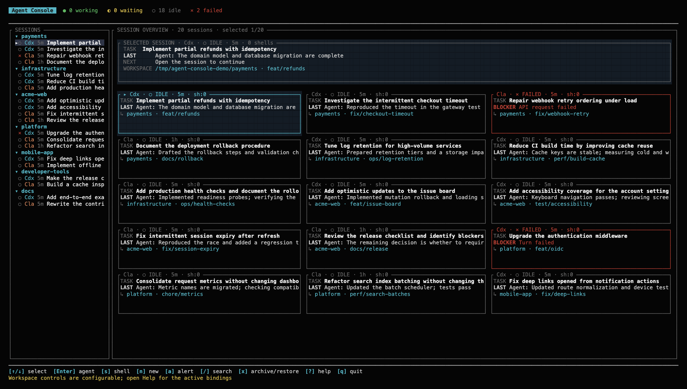

# Agent Console

Agent Console is a local terminal control plane for Codex and Claude Code. The
current implementation contract is in [SPECS.md](SPECS.md); the completed
hardening plan is retained in [PLAN.md](PLAN.md).

Agent Console discovers recent persisted Codex and Claude Code sessions, shows
their current task and activity, resumes them in their native terminal UI, and
provides a Cursor-style workspace with multiple same-directory shell panes.
Session lists are grouped by working directory and use the summarized task as
the session title.

## Interface



The screenshot uses synthetic local transcripts and fake provider commands; it
does not contain a real coding conversation.

## Runtime requirements

- Windows 10+, macOS, or a Unix-like terminal
- `codex` and/or `claude` on `PATH`
- a platform clipboard command: `pbcopy` on macOS, `clip.exe` on Windows, or
  `wl-copy`/`xclip`/`xsel` on Linux

Building from source additionally requires Rust stable. Running the PTY E2E
suite requires `expect`; neither is required when installing a release.

## Install a release

Each [GitHub Release](https://github.com/buhuipao/agent-console/releases)
contains five native packages:

- Windows x86_64: `agent-console-v<version>-x86_64-pc-windows-msvc.zip`
- Linux x86_64 and ARM64:
  `agent-console-v<version>-x86_64-unknown-linux-gnu.tar.gz` and
  `agent-console-v<version>-aarch64-unknown-linux-gnu.tar.gz`
- macOS Intel and Apple Silicon:
  `agent-console-v<version>-x86_64-apple-darwin.tar.gz` and
  `agent-console-v<version>-aarch64-apple-darwin.tar.gz`

Extract the matching archive and place `agent-console` (or
`agent-console.exe`) on `PATH`. Verify the download against the release's
`SHA256SUMS` file.

Starting with v0.0.6, published macOS binaries are signed with the
`Developer ID Application` identity for Apple team `69VD3J69AA`, use the
hardened runtime and a secure timestamp, and are accepted by Apple's notary
service before packaging. The release remains a normal command-line `tar.gz`;
macOS retrieves the standalone binary's notarization ticket online on first
launch because Apple cannot staple a ticket directly to a bare executable.

## Run

```sh
cargo run
```

Check the local setup without opening the TUI:

```sh
cargo run -- doctor
```

## Provider commands

The optional `~/.config/agent-console/config.toml` file can replace the launch
command for each provider:

```toml
[providers]
codex = ["proxychains4", "codex"]
claude = ["env", "HTTPS_PROXY=http://127.0.0.1:7890", "claude"]
```

The first array item is the executable and the remaining items are fixed
arguments. Agent Console appends the session-specific resume, cwd, hook, and
summary arguments. The same configured command is used for both the native
agent and that provider's isolated summarizer. Missing entries default to
`codex` or `claude` on `PATH`.

Set `AGENT_CONSOLE_CONFIG=/path/to/config.toml` to use another config file.
For a single-item command such as `claude = ["auto_claude"]`, Agent Console
first looks for an executable on `PATH`. If none exists, it loads the name as an
alias or function through `$SHELL -ic` and passes all generated arguments via
`"$@"`. Multi-item commands always use direct argv execution without shell
evaluation.

There is exactly one optional custom command per provider. Put wrappers,
environment-variable launchers, proxy commands, aliases, and fixed arguments
directly in that provider's array; Agent Console has no separate provider
profile layer.

## Optional runtime and key configuration

The same file can independently override summary scheduling and key bindings:

```toml
[summary]
min_interval_seconds = 30
failure_backoff_seconds = 30
circuit_failures = 3
circuit_cooldown_seconds = 300

[keys.dashboard]
search = ["/"]
help = ["?"]

[keys.workspace]
focus = ["ctrl-o"]
dashboard = ["ctrl-q"]
```

`[keys.dashboard]` and `[keys.workspace]` replace the defaults one action at a
time. Unsupported labels, unknown actions, empty bindings, and duplicate
effective keys are startup errors. Press `?` to see the complete effective
binding set. Help uses three columns for Dashboard, direct Workspace, and
Session-list controls; child-viewport keys and mouse gestures are included in
the same panel. Modal dialogs show their own edit, commit, and cancel controls,
while the Dashboard and Workspace footers keep only the relevant high-frequency
subset visible. Workspace labels support a printable character, `ctrl-<char>`,
`alt-<char>`, optional Ctrl-Up/Down, Shift-PageUp/Down, and Shift-End.
Printable Workspace actions are active only in `FOCUS SESSIONS`; agent and
shell panes receive those characters unchanged. Ctrl shortcuts are
focus-aware: Shell management chords are handled in a Shell pane and are
forwarded when an Agent pane owns focus, except `Ctrl-\`, which directly opens
a Shell from either child pane. The default keymap reserves no function keys.

## Controls

| Key | Action |
| --- | --- |
| `↑` / `↓`, `j` / `k` | Select a session |
| `Enter` | Open the selected session workspace, focused on the agent |
| `s` | Add a shell and open the workspace, focused on that shell |
| `n` | Start a new Codex or Claude session |
| `/` | Search by alias, task, path, branch, session ID, provider, workspace, or status; filters live while typing |
| `x` | Archive the selected session, or restore it from the `Archived` group |
| `?` | Show effective Dashboard, Workspace, viewport, and mouse bindings |
| `a` | Jump to the next unread waiting/failed alert |
| `q` | Quit |

There is no command menu. Session discovery refreshes automatically; separate
provider, status, and workspace filter modes, pinning, manual refresh, and
per-session summary toggles are intentionally absent. Press `t` only when
a lease-conflict message explicitly offers force takeover.

The Dashboard session list responds to the mouse wheel. Its right side starts
with a full-width `SELECTED SESSION` focus panel containing the selected task,
the current decision/blocker/action, next step, and full workspace. Below it,
an adaptive overview uses at most three cards per row. Every card has a short
status title and a bright `TASK` row; its priority row is `NEEDS YOU`,
`BLOCKER`, `NOW`, or `LAST`, with fallback text when a summary is missing.

Search filters live and labels its `Enter`/`Esc` behavior in the dialog. The
alias dialog likewise explains apply, clear, and cancel. In the new-session
dialog, `Tab` and `Shift-Tab` move between provider and
workspace. Left/Right or `h`/`l` changes provider. The workspace starts as the dashboard directory, but focusing it
selects the whole value: typing or pasting immediately replaces the default.
Left/Right moves the workspace caret, Home/End jumps to either edge,
Backspace/Delete removes before/after the caret, and typing inserts at it.
Long paths scroll horizontally with an ellipsis for hidden content. Directory
matches appear live; Up/Down chooses a match and Tab completes it. Completion
keeps the field active for a child directory; a second Tab returns to
provider. Files are excluded.

Inside a session workspace, the session list stays on the left, the agent is
on the upper right, and shell panes share the lower right. The shell list
remains visible when there are multiple shells. Provider labels keep the same
Codex cyan and Claude orange colors used by the Dashboard. A live two-line
summary above the session list shows the current working, waiting, idle, and
failed totals, so background sessions needing attention remain visible while
another agent is open.

Workspace input is focus-aware; there is no separate command or Vim mode.
Printable keys, `Esc`, function keys, `Ctrl-Enter`, and unrelated Ctrl keys go
to the focused child. While the Agent has focus, Agent Console enables modified
key reporting so nested Codex/Claude sessions can distinguish `Ctrl-Enter` from
plain Enter; that mode is disabled in Shell and Session-list focus. These
navigation chords are global:

| Key | Global Workspace action |
| --- | --- |
| `Ctrl-O` | Cycle Agent → Shell → Sessions focus; create the first shell if needed |
| `Ctrl-Q` | Return to the dashboard |
| `Ctrl-]` | Jump from a live alert to the affected session |

Common Shell operations work directly without visiting the Session list:

| Key | Active focus | Action |
| --- | --- | --- |
| `Ctrl-\` | Agent or Shell | Add and focus a Shell in the current workspace |
| `Ctrl-N` | Shell | Focus the next Shell |
| `Ctrl-X` | Shell | Close the focused Shell immediately |

`Ctrl-N` and `Ctrl-X` are forwarded unchanged while the Agent has focus.
`Ctrl-T` is never reserved, so iTerm2 can continue to own it. A lone `Esc` is
never a Workspace command.

When the Session list has focus:

| Key | Session-list action |
| --- | --- |
| `↑` / `↓`, `j` / `k` | Select a session |
| `Enter` | Start/resume and focus the selected agent |
| `n` | Open the new-session dialog, defaulted to the selected workspace |
| `s` | Add and focus a shell for the selected session |
| `1` … `9` | Focus a numbered shell |
| `m` | Maximize and focus the previously selected Shell |
| `h` | Start/resume, maximize, and focus the selected Agent |
| `+` / `_` | Grow or shrink the shell area |
| `y` | Copy output from the latest submitted shell command |
| `x` | Archive or restore the selected session |

`Shift-PageUp` and `Shift-PageDown` scroll the focused agent or shell pane.
`Shift-End` returns it to the live tail. The pane title shows `SCROLL +N` while
history is visible; ordinary input also returns to the live tail before it is
forwarded. The mouse wheel scrolls the agent or shell pane under the pointer.
Both modern SGR and legacy X10 terminal mouse protocols are accepted. An Agent
that enables mouse reporting receives native clicks, drags, and wheel events;
hold Shift while dragging to use Agent Console's text selection instead. Other
agent and shell cells select and copy on an ordinary drag. Codex-style TUIs
that enable mouse reporting receive native wheel events; Claude-style TUIs
without mouse reporting receive equivalent alternate-screen
cursor scrolling.

When `FOCUS SESSIONS` is shown, use Up/Down (or `j`/`k`) to move between
sessions, `n` to start another session, and `x` to archive or restore the
focused row. The focused row,
rather than the `SESSIONS` heading, receives the
cyan focus treatment. The right side immediately shows the latest local
transcript preview and reconnects any retained shell panes without launching a
provider. Press Enter (or `Ctrl-O`) to start/resume and focus the selected
agent. Browsing therefore remains inside the Workspace and has no provider
startup delay.

Agent Console remembers the transcript fingerprint associated with each
managed Agent. A live daemon-owned Agent is authoritative and is reattached
even when its transcript advanced while the Dashboard was visible; re-entry
never restarts that provider. If no live PTY remains, activation resumes the
provider from the latest local transcript.

Default `Alt-*` controls are not reserved. A lone `Esc` is forwarded after only
the short delay needed to distinguish a terminal escape sequence.

Aliases and archive state persist independently of generated summaries; a
later summary can never overwrite a user alias. Archived sessions stay
selectable in one dimmed `Archived` group at the bottom of the list, where `x`
restores them to their workspace group.

When a background session newly enters `waiting` or `failed`, the dashboard
shows an unread alert and the Workspace status bar shows its reason. Press `a`
on the dashboard, or `Ctrl-]` from a Workspace, to select the affected session.

Staged shell output is inserted with terminal bracketed-paste mode when you next
press `Enter`. It is left in the agent input box and is not submitted
automatically.

Shell panes remain visible after their process exits and show the exit status;
focus one and close it with `Ctrl-X`. Dashboard copy/stage and the Session-list
`y` action use the latest command block when one has been submitted,
falling back to the bounded raw capture before the first command. Dashboard
copy/stage actions are unbound by default.

## Tests

```bash
cargo build --locked
cargo test --locked --all-targets
cargo clippy --locked --all-targets -- -D warnings
expect tests/e2e/workspace_controls.exp
expect tests/e2e/dashboard_controls.exp
expect tests/e2e/daemon_reconnect.exp
expect tests/e2e/session_leases.exp
tests/e2e/provider_compatibility.sh
tests/e2e/real_provider_doctor.sh
expect tests/e2e/real_provider_sessions.exp
```

The fixture E2E tests use isolated local data and fake provider commands. They
do not call Codex, Claude, the network, or the real clipboard. The compatibility
matrix also uses contract fixtures. The real-provider doctor invokes only
`--version`/`--help`; the real-provider session smoke starts and resumes empty
sessions but never sends a prompt. See
[docs/compatibility.md](docs/compatibility.md).

## PTY daemon and reconnect

Agent and shell PTYs are owned by a detached local daemon under the Agent
Console state directory. Quitting the dashboard or crashing/killing the TUI
only detaches the view; it does not terminate those processes. Starting Agent
Console again and opening the same session reconnects the agent and all live
shells, including retained terminal output. Closing a shell explicitly still
terminates that shell.

Raw PTY history is bounded, but reaching that bound never kills or restarts the
agent/shell process. The daemon keeps parsing the live PTY and, when a
reconnecting view has fallen behind the byte tail, restores an authoritative
terminal-screen checkpoint rather than replaying a truncated ANSI sequence.
This keeps full-screen Codex and Claude interfaces intact after high-volume
output.

The daemon grants one Workspace lease per session. A competing TUI is refused
with the current owner PID and instance ID. Press `t` on the dashboard only
when you intentionally want to force takeover; writes from the old owner are
then rejected. A killed owner is detected by PID, so a replacement TUI can
reconnect immediately.

Set `AGENT_CONSOLE_PTY_MODE=local` only for isolated diagnostics that should
restore the old process-local PTY behavior.

Windows uses process-local ConPTY mode automatically. Agent and shell panes
work while Agent Console is running, but they do not survive exiting or
crashing the Agent Console process. Detached reconnect and cross-TUI leases are
currently available on Unix platforms only.

Persistent session metadata and normalized event offsets live in
`state.db` (SQLite WAL mode). A pre-existing `state.json` is imported once.
Provider hooks continue to append JSONL so they stay fast and independent of
database locking; each inbox rotates as current plus previous 256 KiB
generations. The TUI indexes only newly appended complete records and rebuilds
a source when its size or retained-prefix fingerprint shows rotation.

## Continuous summaries

Summaries run in a separate, non-persistent, read-only CLI process. They never
add a message to the coding conversation. A summary always uses the session's
own provider: Claude transcript content is never sent to Codex and Codex
transcript content is never sent to Claude.

```sh
AGENT_CONSOLE_SUMMARIZER=same-provider cargo run  # default
AGENT_CONSOLE_SUMMARIZER=off cargo run
```

The summarizer consumes provider usage. Updates are debounced, serialized, and
scheduled in FIFO order. Each failing session backs off exponentially; repeated
failures open a provider-specific circuit without starving the other provider.
The `[summary]` values above configure the minimum per-session interval, base
backoff, failure threshold, and circuit cooldown. A manual retry action exists
for custom Dashboard key maps but is unbound by default. There is no per-session
summary toggle. A summary failure never stops the coding session.

Claude-mem creates internal Claude sessions under
`~/.claude-mem/observer-sessions` to observe other conversations. Agent Console
filters those background transcripts from the dashboard; it does not delete
them.

## First Codex entry

Codex may show its built-in **Hooks need review** page the first time. Review
the generated commands, which all invoke this binary as:

```text
agent-console hook codex
```

Choose **Trust all and continue** to enable live working/waiting/approval state.
This is Codex's official one-time hook safety review; Agent Console does not
silently bypass it. Session discovery and transcript-based summaries still work
if you continue without trusting the hooks.

Claude hooks are passed through the per-process `--settings` argument; no
Claude settings file is edited.

## State

Cached summaries and hook events are stored under:

```text
~/.local/state/agent-console
```

Override this for testing with `AGENT_CONSOLE_STATE_DIR`.

This directory is private (`0700`) and sensitive files are `0600`. Hook event
files retain a bounded recent tail. Automatic diagnostics are written to
`agent-console.log` with three rotated generations; `doctor` prints the exact
path. Terminal raw mode and the alternate screen are restored during panic
unwinding.

## Known boundary

An arbitrary live process in another Terminal tab cannot have its PTY stolen.
Agent Console discovers its saved conversation and can start the provider's
supported resume command. Live detach/reattach works for processes Agent Console
launched and owns.

## Release automation

`.github/workflows/release.yml` validates that a pushed tag such as `v0.0.6`
matches the version in `Cargo.toml`, runs formatting/lint/tests, builds all five
native packages, generates `SHA256SUMS`, and creates the GitHub Release. The
workflow can also be started manually with publishing disabled to exercise the
entire packaging matrix without creating a release. A push to an explicitly
named `packaging-test/**` branch performs the same non-publishing dry run for
environments where GitHub API dispatch is unavailable.

Published macOS builds reuse NextPlan's Apple team and App Store Connect Team
API key identifiers:

```text
Team ID:   69VD3J69AA
Key ID:    Z665697VSB
Issuer ID: d2af6eee-fb40-4389-ba1c-23320b32bd7d
```

The private material is never stored in git. Configure these repository
Actions secrets before publishing a tag:

| Secret | Value |
| --- | --- |
| `APPLE_DEVELOPER_ID_APPLICATION_P12_BASE64` | Base64 of the password-protected `Developer ID Application: sha qiu (69VD3J69AA)` identity exported as `.p12` |
| `APPLE_DEVELOPER_ID_APPLICATION_PASSWORD` | Password chosen when exporting that `.p12` |
| `APPLE_NOTARY_KEY_P8_BASE64` | Base64 of NextPlan's `AuthKey_Z665697VSB.p8` Team API private key |

On macOS, encode the two files without writing another unencrypted copy:

```sh
base64 -i DeveloperIDApplication.p12 | pbcopy
base64 -i AuthKey_Z665697VSB.p8 | pbcopy
```

The first macOS release step imports the `.p12` into an ephemeral keychain,
selects only a `Developer ID Application` identity belonging to the expected
team, signs the Rust executable, and deletes the keychain. The next step submits
a temporary ZIP through `notarytool`, requires an explicit `Accepted` result,
verifies the embedded signature with `codesign`, and only then creates the
public `tar.gz`. `spctl --type execute` is deliberately not used as a CI gate:
that command rejects standalone command-line Mach-O files as “not an app” even
when their Developer ID signature and notarization ticket are valid. The
release smoke test instead executes a notarized binary carrying a quarantine
attribute, which exercises the actual Gatekeeper launch path. Non-publishing
packaging dry runs remain unsigned and do not require Apple secrets.
