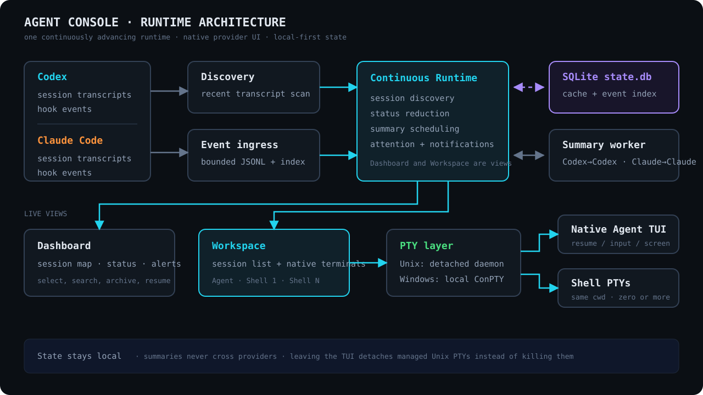

# Agent Console

Agent Console is a local terminal dashboard for Codex and Claude Code. It
discovers recent sessions, shows their current state, resumes the native agent
UI, and keeps same-workspace shells beside each agent.


Twenty sessions across seven workspaces, both providers in one list. A session
stops for an approval, the dashboard raises an alert, and `a` jumps straight to
it. `s` opens a shell in that session's own directory, beside the agent.

## What it provides

- Codex and Claude Code sessions grouped by workspace
- Working, waiting, idle, and failed status at a glance
- Same-provider progress summaries
- Native agent resume instead of a replacement chat UI
- Multiple persistent shell panes in the agent workspace
- Search, archive/restore, alerts, and mouse scrolling

## Architecture



## Requirements

- macOS, Linux, or Windows 10+
- `codex` and/or `claude` available on `PATH`
- A terminal with ANSI and mouse support

## Install

Download the package for your platform from
[GitHub Releases](https://github.com/buhuipao/agent-console/releases):

- macOS Intel: `agent-console-v<version>-x86_64-apple-darwin.tar.gz`
- macOS Apple Silicon: `agent-console-v<version>-aarch64-apple-darwin.tar.gz`
- Linux Intel: `agent-console-v<version>-x86_64-unknown-linux-gnu.tar.gz`
- Linux ARM64: `agent-console-v<version>-aarch64-unknown-linux-gnu.tar.gz`
- Windows Intel: `agent-console-v<version>-x86_64-pc-windows-msvc.zip`

Extract the archive and place `agent-console` (`agent-console.exe` on Windows)
in a directory on `PATH`. On macOS, install and upgrade it with an atomic
rename so the kernel never reuses a cached signature from the old inode:

```sh
sudo install -m 755 ./agent-console /usr/local/bin/agent-console.new
sudo mv -f /usr/local/bin/agent-console.new /usr/local/bin/agent-console
```

Do not copy directly over a running or previously launched signed binary on
macOS. Agent Console is a terminal program; launch it from your terminal rather
than Finder.

Published macOS binaries are signed with Developer ID, use the hardened
runtime, and are accepted by Apple's notarization service. Because Apple cannot
staple a ticket to a standalone executable or `tar.gz`, macOS may perform an
online notarization lookup on first launch.

## Start

```sh
agent-console
```

`agent-console --version` and `agent-console --help` print metadata without
opening the dashboard.

Check provider and terminal prerequisites without opening the dashboard:

```sh
agent-console doctor
```

## Provider commands

Use `~/.config/agent-console/config.toml` when a provider needs a wrapper,
proxy, environment variables, or fixed arguments:

```toml
[providers]
codex = ["proxychains4", "codex"]
claude = ["env", "HTTPS_PROXY=http://127.0.0.1:7890", "claude"]
```

Missing entries use `codex` or `claude` directly. The configured command is
also used by that provider's isolated summarizer. Set
`AGENT_CONSOLE_CONFIG=/path/to/config.toml` to use another file.

Limit Agent Console to a subset of providers with a comma-separated
`AGENT_CONSOLE_PROVIDERS`:

```sh
AGENT_CONSOLE_PROVIDERS=codex agent-console
```

Omitted providers are not scanned and are left out of `doctor`. An unset or
unrecognized value keeps every provider enabled.

## Controls

Dashboard:

| Key | Action |
| --- | --- |
| `↑` / `↓`, `j` / `k` | Select a session |
| `Enter` | Open the selected agent |
| `s` | Open a shell |
| `n` | Create a session |
| `/` | Search sessions as you type |
| `x` | Archive or restore |
| `a` | Jump to the next alert |
| `r` | Retry the selected session's summary now |
| `?` | Show all active controls |
| `q`, `Esc` | Quit |

When another Agent Console owns the selected live session, the message shown
on screen offers `t` for an intentional force takeover.

Inside a session workspace:

| Key | Action |
| --- | --- |
| `Ctrl-\` | Cycle Agent → Shell → Sessions focus |
| `Ctrl-^` | Create and focus a shell |
| `Ctrl-N` | Focus the next shell while Shell has focus |
| `Ctrl-X` | Close the focused shell |
| `Ctrl-Q` | Return to the dashboard |

With the Sessions list focused:

| Key | Action |
| --- | --- |
| `↑` / `↓`, `j` / `k` | Select a session |
| `Enter`, `Ctrl-\` | Open/resume and focus its agent |
| `/` | Search sessions as you type |
| `a` | Jump to the next unread alert |
| `?` | Show the Workspace key bindings |
| `n` | Create a session in the selected workspace |
| `s` | Create and focus a shell |
| `x` | Archive or restore the session |
| `h` | Maximize and focus the agent |
| `m` | Maximize and focus the last selected shell |
| `+` / `_` | Grow or shrink the shell area |
| `y` | Copy the latest shell command output |
| `1` … `9` | Focus a numbered shell |

After `h` or `m`, use `Ctrl-\` until focus returns to Sessions; the normal split
layout is restored automatically.

Agent and shell viewport controls:

| Input | Action |
| --- | --- |
| `Shift-PageUp` / `Shift-PageDown` | Scroll one viewport |
| Any key sent to the child | Return to live output |
| Mouse wheel | Scroll the pane under the pointer |
| Drag | Select and copy immediately; do not press `Cmd-C` afterward |
| Terminal bypass modifier + drag | Use native selection, then copy normally (`Option`-drag in iTerm2; commonly `Shift`-drag elsewhere) |

The new-session dialog uses `Shift-Tab` to switch between provider and
workspace, arrows (or `h` / `l`) to choose a provider, normal cursor movement
and editing in the workspace path, Up/Down to choose a directory completion,
`Tab` to accept it, `Enter` to start, and `Esc` to cancel. Search filters live
on both Dashboard and the focused Sessions list; `Enter` keeps the filter and
`Esc` restores it. It matches aliases, provider session names and generated
titles, first/latest prompts, conversation summaries, Claude tags and PR/MR
metadata, workspace names and paths, branches, provider session IDs, providers,
statuses, and active/archived state.

The three globally reserved chords — `Ctrl-\`, `Ctrl-^`, and `Ctrl-Q` — are the
only Ctrl combinations Codex and Claude Code leave free, so everything those
tools bind reaches them untouched: `Ctrl-O` (Claude's transcript toggle, Codex's
copy-response), `Ctrl-]`, `Shift-End`, `Ctrl-T`, `Ctrl-Enter`, `Esc`, function
keys, and every other Ctrl or Alt combination. `Ctrl-N` and `Ctrl-X` are
reserved only while a shell has focus and are forwarded in Agent focus. Press
`?` for the authoritative context-sensitive key list, including any bindings
overridden in the configuration file.

## Notes

- A session is titled by its first user prompt and keeps that title for life.
  Later prompts and summaries never rename it. Bind the `alias` action in
  `[keys.dashboard]` to set your own title instead.
- Summaries use the session's own provider and run outside the coding
  conversation, and appear in the session preview beside the first prompt rather
  than in the title. Disable them with `AGENT_CONSOLE_SUMMARIZER=off`.
- The summary command reuses your configured provider command, prompt included
  as an argument, so a wrapper that gives the provider a terminal still works.
- Agent Console can reconnect only to processes it launched and owns. Existing
  sessions from other terminal tabs are resumed from their saved transcript.
- Managed Codex sessions run with `--no-alt-screen`, allowing the Workspace
  pane to retain and scroll the transcript in every Codex state.
- Running Codex fork subagents are identified from transcript metadata and
  disappear from Sessions when their final task completes or aborts.
- Each managed pane retains up to 2,000 scrollback rows. The separate 128 KiB
  daemon replay tail is a reconnect transport bound; crossing it does not stop
  the process or discard Codex's retained viewport rows.
- Local state is stored under `~/.local/state/agent-console` by default.
- Detailed behavior and constraints are documented in [SPECS.md](SPECS.md).

## Build and test

```sh
cargo build --locked
cargo test --locked --all-targets
cargo clippy --locked --all-targets -- -D warnings
```

Provider compatibility details are in
[docs/compatibility.md](docs/compatibility.md).

## License

Licensed under either of [Apache License, Version 2.0](LICENSE-APACHE) or
[MIT license](LICENSE-MIT) at your option.

Unless you explicitly state otherwise, any contribution intentionally submitted
for inclusion in this crate by you, as defined in the Apache-2.0 license, shall
be dual licensed as above, without any additional terms or conditions.
